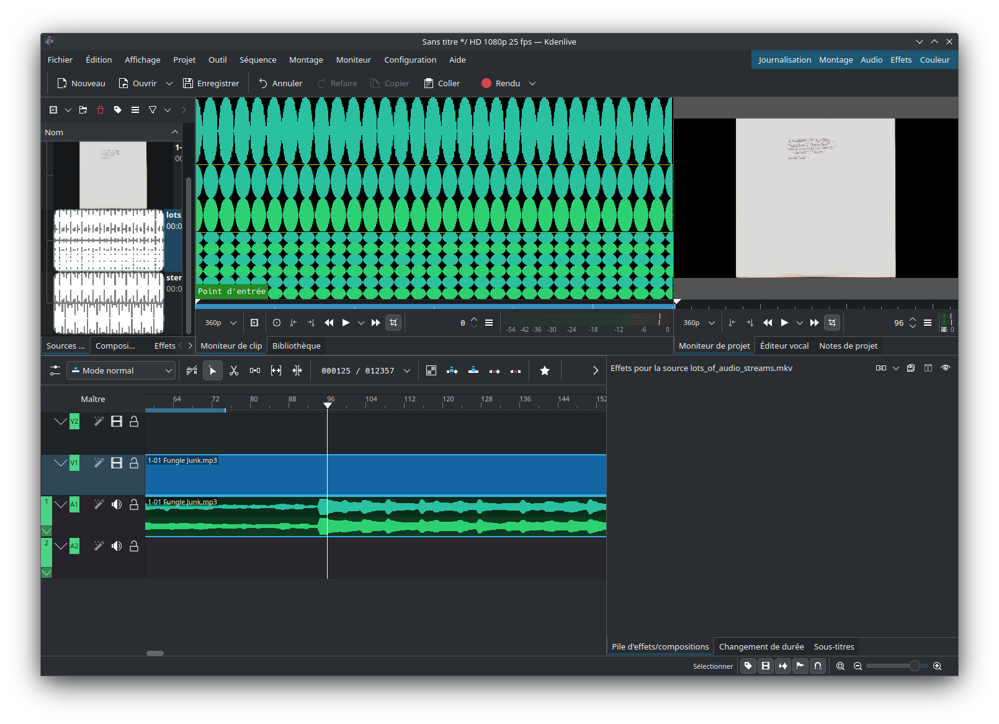
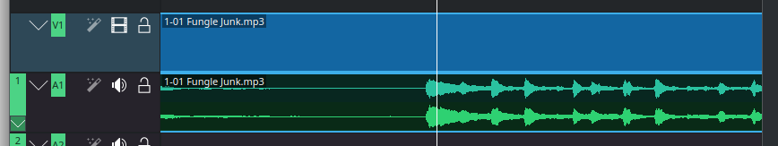
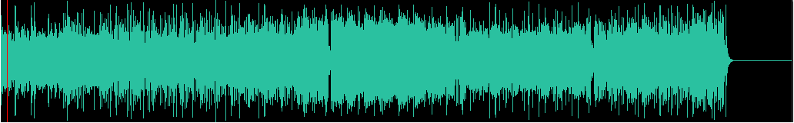
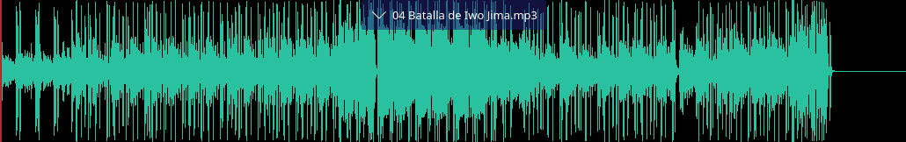
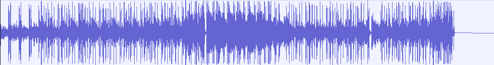

+++
title = "Audio Waveforms in Kdenlive: Technical Upgrades for Speed, Precision, and better UX"
date = 2025-01-27T12:00:37+01:00
draft = false
+++

I recently worked on audio waveform generation in [Kdenlive](https://kdenlive.org), an actively developed free and open-source [non-linear video editor](https://en.wikipedia.org/wiki/Non-linear_editing). It boasts a user base of over 100,000 users per release on Linux, Windows, and macOS.



To improve user experience and overall performance, one focus was enhancing audio thumbnails—the small waveforms displayed on the timeline and in the clip player.

Previously, generating these was slow, leading to frustrating delays for users starting their projects. Precision and correctness also left much to be desired, making them confusing to look at and work with.

**Here's how I tackled these challenges to overhaul the waveform rendering process.**

## Why Good Audio Waveforms Matter



**Audio waveforms provide a visual understanding of sound.** They originate from analog oscilloscopes, where the horizontal axis represents time and the vertical axis shows amplitude. While they are not the only way to visualize audio, they are the most ubiquitous, making them a universally recognized symbol for audio signals.



This simple idea has been extended to fit more specialized use cases and can be adapted to diverse design choices.





## Challenges in Waveform Rendering

**Rendering correct digital waveforms fast isn’t straightforward.** Naively connecting all audio samples would be inefficient and impractical at usual audio sample rates (e.g., 44,100 Hz and above). Instead, **summarizing** the signal—finding peak amplitudes for each pixel column—allows for efficient and clear rendering.



In video editing, the smallest unit of time is often the length of a video frame (1/20–1/60 of a second). Drawing audio waveforms at roughly this resolution is sufficient for most workflows. However, there are still a few challenges:

1. **Memory Constraints**: Entire audio files can't always be loaded into memory due to simultaneous handling of multiple tracks.
2. **Disk I/O Limits**: Continuously reading files from disk is slow, even with SSDs.
3. **Decoding and Seeking Overheads**: Decoding takes time, and not all media formats are easily seekable (or at all), adding latency.

To address these challenges, we **precompute** low-resolution summaries then **cache** them in *peak files*[^peakfiles]. This allows the application to display waveforms quickly without repeatedly decoding the audio.
[^peakfiles]: I'm not sure this is the consacred term, but audio software users are likely familiar with these, which end up littered *everywhere*: `.asd` for Ableton Live, `.pkf` for Adobe products, and so on...

## Why Kdenlive’s Approach Needed an Upgrade

Kdenlive is based on [MLT](https://www.mltframework.org/), a C framework designed as a toolkit for multimedia applications, with a focus on video editing. This library provides the abstractions that software like Kdenlive (and [Shotcut](https://www.shotcut.org/)) use. In fact, one could argue that Kdenlive is, at its core, an MLT front-end.

Kdenlive already utilized MLT’s [`audiolevel` filter](https://www.mltframework.org/plugins/FilterAudiolevel/) to generate and cache audio summaries. However, this approach had limitations:

- **Precision**: A resolution of one point per video frame was too coarse and hid critical audio details.
- **Performance**: Generating summaries was significantly slower than in other video editors.
- **Correctness**: Rendered waveforms didn’t align with reference software.

Through targeted investigation and development, along with valuable input and support from Kdenlive developers and maintainers, I addressed these challenges to significantly enhance all these aspects.

## The Results

### Precision

The easiest fix was to increase the resolution from 1 point per frame to **5 points per frame**, achieving a balance between generation speed and precision.

**1 point per frame:**

**5 points per frame:**

### Performance

Profiling revealed MLT’s `audiolevel` filter as the main bottleneck: it was slower to retrieve frame metadata than to decode audio. Replacing it with a streamlined implementation reduced unnecessary operations and resulted in a modest performance boost.

The best gains came from bypassing MLT entirely by leveraging the ubiquitous `libav` library directly, where applicable. (For a code walkthrough on decoding audio streams using libav, check out [this blog post]({}).) This resulted in **up to a 3x performance boost**, while still increasing resolution fivefold.

**Generation times** (on my machine, a modest AMD Ryzen 7 3700U with SSD storage):

| Test File            | MLT, before changes | Libav, after changes | MLT, after changes |
| -------------------- | ------------------- | -------------------- | ------------------ |
| 1h 20min stereo WAV  | 8.13s               | 2.48s (-228%)        | 5.19s (-57%)       |
| 1h 20min stereo FLAC | 12.51s              | 6.82s (-83%)         | 9.03s (-39%)       |
| 26 min OPUS in MKV   | 8.61s               | 4.77s (-81%)         | 6.86s (-26%)       |

### Correctness

The old method sampled precomputed summaries at regular intervals, leading to artifacts and detail loss due to aliasing, as described by the [sampling theorem](https://en.wikipedia.org/wiki/Nyquist%E2%80%93Shannon_sampling_theorem). The new approach avoids this by re-summarizing peaks within each visual interval, ensuring waveforms faithfully represent the audio signal.

**Before changes:**

**After changes:**

**Reference (Audacity):**

## Conclusion

These improvements make audio waveform rendering in Kdenlive faster, more accurate, and more reliable. You'll be able to see the new rendering method in **Kdenlive 25.04** (due April 2025) !

This is just one of many ways the Kdenlive team continues to enhance the user experience. If you’d like to support them, consider [contributing](https://kdenlive.org/en/developers-welcome/) or donating to the [Kdenlive fundraiser](https://kdenlive.org/en/fund/).

*Disclaimer: This task was completed as part of contract work with [KDE e.V.](https://ev.kde.org/), made possible by the Kdenlive fundraiser.*
