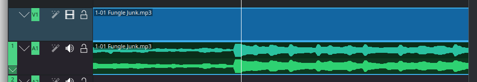

+++
title = 'Reworking Kdenlive waveform rendering'
date = 2024-12-14T18:24:37+01:00
draft = true
+++

I recently worked on audio waveform generation in [Kdenlive](https://kdenlive.org), a free and open-source [non-linear video editor](https://en.wikipedia.org/wiki/Non-linear_editing) that’s actively being developed. It’s available on all major desktop platforms and has a solid user base of over 100,000 users per release on Linux, Windows, and macOS.

One of the goals of the [Kdenlive fundraiser](https://kdenlive.org/en/fund/) is to enhance the overall performance of the editor. A specific area we focused on was the generation of audio thumbnails—the small audio previews that appear on the timeline and in the clip player.

In the past, loading media with audio content could be slow, which meant users had to wait before getting started on their projects. There were also some issues with precision and correctness that needed addressing.

Join me as I share how we improved the waveform rendering process!

*Disclaimer: This task was done as part of contract work with [KDE e.V.](https://ev.kde.org/), thanks to the Kdenlive fundraiser.*

## Why audio waveforms matter



The gist is, **audio waveforms enable a visual understanding of sound.**

We've all seen what we colloquially call audio waveforms. Other visual audio representations exist, but this is the ubiquitous one, instantaneously recognizable by all, an universally understood symbol for audio signals.



The way we represent audio waveforms finds its origins in old analogue oscilloscopes. The horizontal axis is time, and the vertical axis is the amplitude. This simple idea can be extended to fit more specialized use-cases or design choices.





## Challengies in waveform rendering

When working with digital audio, drawing a waveform can be as simple as iterating over all the samples and connecting the dots (or, alternatively, drawing lollipops[^sinc], or bars[^bars]).

[^sinc]: Or better yet, draw the estimated analog waveform using [sinc interpolation](https://en.wikipedia.org/wiki/Whittaker%E2%80%93Shannon_interpolation_formula) !

[^bars]: The bar drawing method makes the signal appear as a "staircase" - which has misled many people on the supposed shortcomings of digital audio. [See here.](https://xiph.org/video/vid2.shtml)
  
If there are only a few samples to draw, this can be enough. But usual audio sample rates usually [go up from 44100 Hz](https://en.wikipedia.org/wiki/Sampling_(signal_processing)#Audio_sampling), meaning that we get least 44100 points for just one second of audio ! Drawing each sample individually would take **forever**. Besides, all the samples would be so close to each other that you could really only see the overall shape of the signal, anyway.



In this case, the usual approach is to "summarize" the signal before rendering it on screen. For each pixel column that is to be drawn, find out the corresponding start and end times in the signal. In this interval, compute the negative and positive peaks, and simply draw a vertical line between them. Do that enough times and you end up with that typical spiky blob-like shape. That's way more efficient !



### Different needs: Audio vs Video Editing Software

Coming from an audio background, I'm mostly familiar with audio software. While audio professionals would expect to be able to manipulate audio data at the sample level, it is not the case for video workflows. When dealing with video, the smallest indivisible unit of time often considered is the *video frame* (typically 1/20 to 1/60 of a second): at these resolutions, drawing summaries is more than enough for a good user experience.

Another important difference is that in typical audio editing tasks, especially with today’s powerful machines, it’s often possible to load entire audio files into memory. This allows for quick access to the audio data when it’s time to display it on the screen.

However, in video editing and more complex audio applications like DAWs, loading all media into memory isn’t practical. Multiple audio and video tracks are usually managed simultaneously, making it challenging to fit everything in. Plus, reading files from disk each time we want to display them isn’t a viable option either. Even the fastest SSDs available today can’t keep up, and we also have to consider decoding times. On top of that, not all media formats allow for easy seeking, which adds another layer of performance issues.

Another key difference is that in typical audio editing tasks, and with today's machines, the entire audio files can be loaded in memory. This makes accessing the audio data very fast when time comes to draw it on the screen.

In video editing (and in heavy audio applications, such as DAWs), it is is unthinkable to fit all the media in memory as multiple audio and video tracks are typically handled at once. It is also not feasible to simply read the files on disk each time we want to draw them on screen. Even the fastest SSDs we can find nowadays would not be fast enough, and that's not even accounting for decoding time - not to mention that not all media formats are easily seekable.

### The solution: caching summaries

So, what do we do ? We can't fit the files in memory, and we can't read them off the disk fast enough.

The usual approach is to summarize the waveform once at a resolution acceptable for screen rendering. The summary is then cached in so-called *peak files*[^peakfiles]. When drawing the audio waveform on screen, the application simply uses the cached summary instead of having to re-read the files on disk each time.

[^peakfiles]: Audio software users likely are familiar with these, which end up littered *everywhere*: `.asd` for Ableton Live, `.pkf` for Adobe products, and so on...

## Why Kdenlive's approach needed an upgrade

And, in fact, Kdenlive already did just that ! So what's the problem then ? To understand it, we must go a bit deeper into Kdenlive's architecture.

Kdenlive is based on [MLT](https://www.mltframework.org/), a C framework which aims to be a toolkit for multimedia applications, focused on video editing. This library provides the abstractions that software like Kdenlive (and [Shotcut](https://www.shotcut.org/), and others) use - in fact one could argue that Kdenlive is, at its core, a MLT front-end.

All objects in MLT (called **services**) produce, consume or transform **frames** of audio/video. Among them, the **producers** read frames from a video file or another composition, the **consumers** ingest frames to display them on the screen or encode them to a media file, and the **filters** transform frames. All these services can be then connected in a **network**, to create complex audio/video graphs. There's a lot more going into it, if you're interested, the [MLT Docs](https://www.mltframework.org/docs/framework/) provide a great overview.

As a matter of fact, MLT provides the [`audiolevel` filter](https://www.mltframework.org/plugins/FilterAudiolevel/) that does exactly what we want. aJust plug it on a producer, and each time it reads a frame, it will compute its overall amplitude. Generating a summary is as simple as reading frames in a loop, and storing the sound amplitude in a vector somewhere. That's it ! No need to fiddle with complicated audio format stuff: everything is abstracted away by MLT.

Unfortunately, as convenient as this approach is, it suffered from a few limitations.

- **Performance**: Easily the worst offender. Generating audio summaries will always take *some* time (after all, you have to read and decode the whole file), but other video editors seem able to do it much, much quicker.
- **Precision**: Computing only one point per frame is not enough for a smooth user experience. This level of precision simply hides too much information to be useful.
- **Correctness**: The rendering also looked like it did somme funky stuff: comparing it with some reference renderings from other audio software, something was defenitly off.
<!-- - Also, the audio levels were stored in a 8-bit unsigned int, and thus was able to store only $2^8 = 256$ discrete steps, which did not really help. -->

### Fixing audio waveform rendering

To tackle these, I first started by profiling the current implementation, to identify the root cause of the performance issues. The investigation hinted at the audiolevel filter being the root of the problem, especially accessing its results. In fact, most of the time spent during computing the summary was doing bookkeeping !

Using a profiler effectively in a complex application such as Kdenlive can be difficult, and is out of scope of this blog post. [I've written a tutorial on how it was done here]({}).

Ultimately we've opted to use `libav` directly. This enables us to completely bypass MLT and its performance issues. Using libav can be a little difficult, [I've written up a guide with annotated C source here.]({})

The last part of the puzzle is fixing the waveform drawing function. The previous one did sampled n samples for n pixels to render, resulting in wildly incorrect renderings. The new one correctly uses a sliding window over the precomputed summaries, which is a bit slower, but results in correct waveforms.

## The results

### Performance

Measured time taken for audio levels generation in release builds on my machine (AMD Ryzen 7 3700U, files stored on SSD).

- *original MLT* is before these changes, with one point per frame;
- *new MLT* is the improved method, with 5 points per frame;
- *new libav* is the method using libav directly, with 5 points per frame.

| Test file                                | new method (libav) | new method (MLT) | old method (MLT) |
| ---------------------------------------- | ------------------ | ---------------- | ---------------- |
| 1 h 20 min of stereo uncompressed WAV    | 2.477 s            | 5.187 s          | 8.131 s          |
| 1 h 20 min of stereo max-compressed FLAC | 6.818 s            | 9.03 s           | 12.513 s         |
| 26 min of OPUS audio in a MKV video file | 4.774 s            | 6.86 s           | 8.614 s          |

### Resolution

**Before changes (KDenlive 24.08.3):**

**After changes:**

### Correctness

**Before changes (KDenlive 24.08.3)**

**After changes:**

**Reference (audacity)**

**Stretching a waveform, before changes:**

**Stretching a waveform, after changes:**

 
# Conclusion